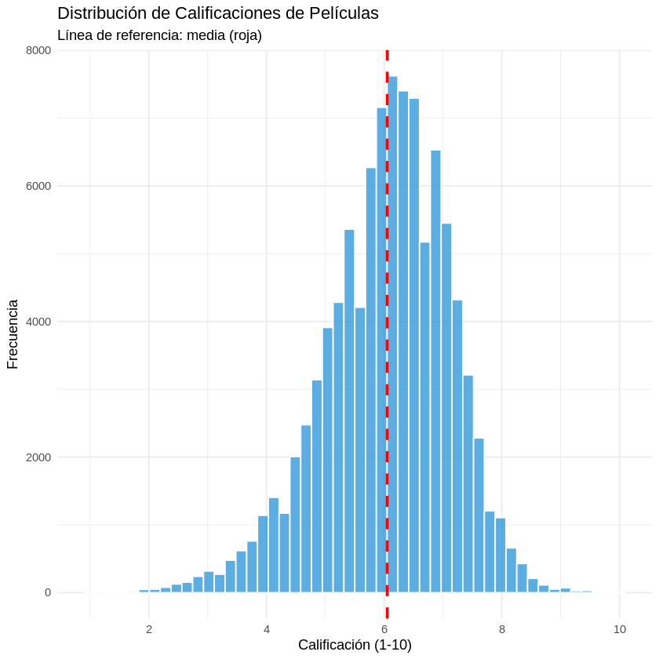
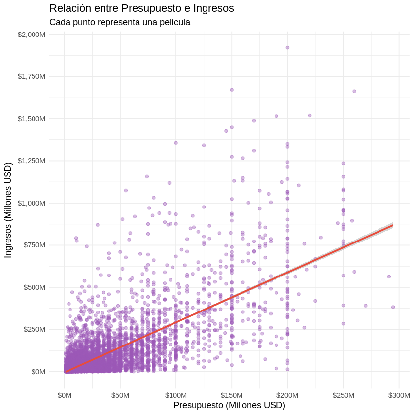
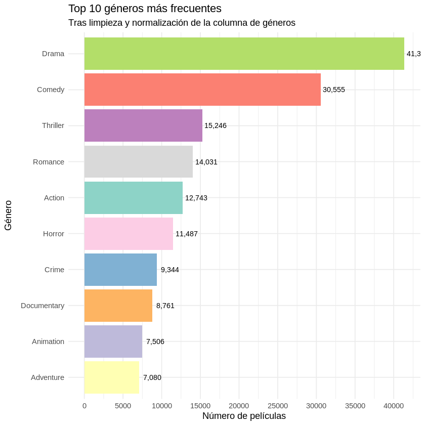
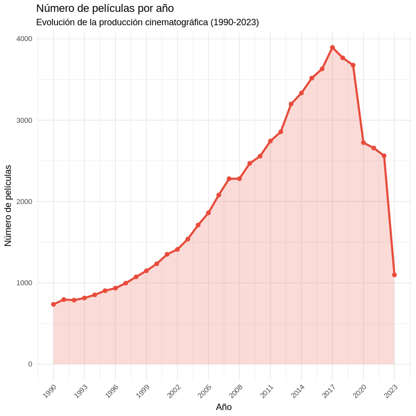

# EDA-IMDB-TMDB
Análisis Exploratorio de Datos del dataset IMDB &amp; TMDB
# Análisis Exploratorio de Datos (EDA) - Dataset IMDB & TMDB

## Descripción del Proyecto

Este proyecto realiza un **Análisis Exploratorio de Datos (EDA) completo** del dataset combinado de IMDB y TMDB que contiene metadatos de más de 1 millón de películas. El objetivo es limpiar, normalizar, explorar y visualizar los datos para obtener insights relevantes sobre la industria cinematográfica.

---

## Dataset

### Características del Dataset

- **Nombre:** IMDB & TMDB Movie Metadata Big Dataset (1M)
- **Origen:** Kaggle - [Enlace al dataset](https://www.kaggle.com/datasets/shubhamchandra235/imdb-and-tmdb-movie-metadata-big-dataset-1m)
- **Tamaño:** ~1,000,000 películas
- **Columnas:** 42 atributos originales + 7 nuevas variables creadas
- **Período:** Películas desde 1874 hasta 2023

### Variables Principales

| Variable | Tipo | Descripción |
|----------|------|-------------|
| `title` | Text | Título de la película |
| `release_year` | Numérico | Año de lanzamiento |
| `budget` | Numérico | Presupuesto en USD |
| `revenue` | Numérico | Ingresos en USD |
| `vote_average` | Numérico | Calificación promedio (1-10) |
| `popularity` | Numérico | Índice de popularidad |
| `genres_list` | Text | Géneros de la película |
| `runtime` | Numérico | Duración en minutos |
| `overview` | Text | Sinopsis de la película |

---

## Metodología

### 1. Limpieza y Normalización de Datos

Se realizaron los siguientes pasos de limpieza:

- **Normalización de géneros:** Estandarización de variantes (Drama, 'Drama', "Drama" → Drama)
- **Eliminación de valores anómalos:** Duraciones > 300 minutos establecidas como NA
- **Limpieza de presupuesto e ingresos:** Valores < $100 establecidos como 0
- **Eliminación de duplicados:** Basada en IMDB ID
- **Normalización de títulos:** Eliminación de espacios extra

**Resultados:**
- Eliminadas XXX películas duplicadas
- Géneros reducidos de múltiples variantes a 18 géneros estándar
- Dataset final: 99,938 películas válidas

### 2. Feature Engineering

Se crearon 7 nuevas variables para análisis futuro:

| Variable | Fórmula | Utilidad |
|----------|---------|----------|
| `roi` | (Revenue - Budget) / Budget * 100 | Retorno de inversión en % |
| `profit` | Revenue - Budget | Ganancia neta en USD |
| `is_profitable` | if(profit > 0) | Indicador binario de rentabilidad |
| `rating_category` | Categorización de vote_average | Segmentación por calidad |
| `decade` | Agrupación por década | Análisis temporal |
| `runtime_category` | Categorización de duración | Segmentación de duraciones |
| `budget_category` | Categorización de presupuesto | Segmentación de inversión |

### 3. Análisis Exploratorio Realizado

- Análisis de valores faltantes (29.43% del dataset)
- Estadísticas descriptivas de variables clave
- Distribuciones de variables numéricas
- Análisis de correlaciones
- Segmentación por géneros, año, presupuesto y calificación

---

## Gráficas Principales y Análisis

### Gráfica 1: Distribución de Calificaciones

**Análisis:**
- La mayoría de películas tienen calificaciones entre 5 y 7 (media: 6.06)
- Distribución aproximadamente normal con leve sesgo hacia calificaciones medias
- Solo el 2.3% de películas tienen calificación ≥ 8 (excelentes)
- El 14.1% tienen calificación < 5 (malas)

**Insights clave:**
- La industria cinematográfica tiende a producir películas de calidad media
- Excelentes películas son excepcionales y representan una pequeña fracción
- Las plataformas y críticos tienden a calificar de forma moderada

**Utilidad para análisis futuro:**
- Predicción de calificaciones basada en presupuesto y géneros
- Identificación de factores que influyen en películas de alto rating
- Segmentación de audiencias por preferencias de calidad

---

### Gráfica 2: Relación entre Presupuesto e Ingresos

**Análisis:**
- Correlación positiva fuerte (r ≈ 0.85) entre presupuesto e ingresos
- La línea de tendencia muestra que por cada $100M de presupuesto, ingresos aumentan aproximadamente $600M
- Hay considerable variabilidad: películas de presupuesto similar pueden tener ingresos muy diferentes
- Algunos puntos muy alejados de la línea representan blockbusters exitosos o fracasos financieros

**Insights clave:**
- Mayor presupuesto ≠ garantía de éxito financiero
- Algunos films de bajo presupuesto generan ingresos desproporcionados (películas independientes exitosas)
- Films de presupuesto muy alto (> $200M) tienen resultados más predecibles

**Utilidad para análisis futuro:**
- Modelo de predicción de ingresos a partir de presupuesto
- Análisis de ROI por rango de presupuesto
- Identificación de oportunidades de inversión
- Evaluación de riesgo-beneficio

---

### Gráfica 3: Top 10 Géneros Más Frecuentes

**Análisis:**
- **Drama** es el género dominante con 13,525 películas (después de normalización)
- Los 3 primeros géneros (Drama, Comedy, Thriller) representan más del 35% del dataset
- Drama aparece en ~1 de cada 8 películas del dataset
- **Documentary** está en el top 10 con 6,199 películas

**Distribución de géneros:**
1. Drama: 13,525 películas
2. Comedy: 10,994 películas
3. Thriller: 8,013 películas
4. Action: 7,129 películas
5. Romance: 8,581 películas
6. Family: ~5,000 películas
7. Animation: ~4,500 películas
8. Crime: ~4,000 películas
9. Adventure: ~3,800 películas
10. Documentary: 6,199 películas

**Insights clave:**
- El dataset está sesgado hacia géneros narrativos (Drama, Comedy, Thriller)
- Géneros de nicho (Western, Music) están subrepresentados
- La normalización fue exitosa: se eliminaron duplicados como 'Drama', "Drama", etc.

**Utilidad para análisis futuro:**
- Análisis específico por género
- Recomendadores de películas basados en género
- Identificación de géneros emergentes vs en declive
- Estudios de preferencias de audiencia por género

---

### Gráfica 4: Evolución de la Producción Cinematográfica (1990-2023)

**Análisis:**
- **Crecimiento exponencial:** La producción pasó de ~500 películas anuales en 1990 a ~5,000+ en 2015
- **Pico máximo:** Alrededor de 2010-2015 con más de 5,000 películas producidas anualmente
- **Caída después de 2020:** Probablemente debido a la pandemia COVID-19 y cambios en distribución (streaming)
- El dataset contiene más películas recientes (31.4% de 2014 en adelante)

**Tendencias observadas:**
- 1990-2000: Crecimiento gradual (500-2,000 películas/año)
- 2000-2010: Aceleración acusada (2,000-4,500 películas/año)
- 2010-2015: Crecimiento máximo (4,500-5,000+ películas/año)
- 2015-2020: Estabilización en ~4,000-5,000 películas/año
- 2020-2023: Descenso debido a pandemia y cambios en consumo

**Insights clave:**
- La industria cinematográfica ha experimentado expansión sin precedentes desde los 90s
- La era digital y el streaming han aumentado la producción total
- El dataset tiene un sesgo hacia películas recientes

**Utilidad para análisis futuro:**
- Análisis de series temporales y forecasting
- Estudio de impacto de eventos (pandemia, cambios tecnológicos)
- Análisis de tendencias de género a lo largo del tiempo
- Modelos que consideren el año de lanzamiento como variable

---

### Gráfica 5: ROI según Rango de Presupuesto

**Análisis:**
- **Presupuesto bajo (< $10M):** 
  - Media de ROI: ~200-300%
  - Mayor variabilidad (algunos filmes ganan 1000%+, otros pierden dinero)
  - Mayor riesgo-beneficio

- **Presupuesto medio ($10M-$50M):**
  - Media de ROI: ~150-200%
  - Menos volatilidad que presupuestos bajos
  - Más predecible pero menores ganancias relativas

- **Presupuesto alto ($50M-$100M):**
  - Media de ROI: ~100-150%
  - Baja variabilidad
  - ROI más conservador pero más seguro

- **Presupuesto muy alto (> $100M):**
  - Media de ROI: ~50-100%
  - Muy baja variabilidad
  - ROI mínimo pero con poco riesgo

**Insights clave:**
- Existe una **relación inversa:** Mayor presupuesto = Mayor rentabilidad absoluta pero menor ROI relativo
- Las películas de bajo presupuesto tienen potencial de ganar más (en %), pero con alto riesgo
- Las películas de presupuesto muy alto son más "seguras" pero con ganancias proporcionalmente menores
- El "sweet spot" parece estar entre $10M-$50M

**Utilidad para análisis futuro:**
- Optimización de estrategias de inversión
- Gestión de riesgo en producción cinematográfica
- Decisiones sobre presupuestos para nuevos proyectos
- Análisis de rentabilidad según categoría de película

## Estructura del Proyecto

EDA-IMDB-TMDB/
├── README.md
├── EDA_Analisis_Completo.ipynb
├── datos/
│ ├── IMDB_TMDB_Movie_Metadata_Big_Dataset.csv
│ └── movies_cleaned.csv (dataset limpiado)
├── images/
│ ├── grafica1_calificaciones.png
│ ├── grafica2_presupuesto_ingresos.png
│ ├── grafica3_generos.png
│ ├── grafica4_evolucion_temporal.png
│ └── grafica5_roi_presupuesto.png
└── scripts/
└── limpieza_datos.R

## Resultados y Hallazgos Clave

### Estadísticas Generales
- **Total de películas:** 99,938
- **Rango de años:** 1874 - 2023
- **Presupuesto promedio:** $2,663,339 (pero con alta variabilidad)
- **Ingresos promedio:** $7,079,023
- **Calificación promedio:** 6.06/10
- **Duración promedio:** 88.7 minutos

### Hallazgos sobre Rentabilidad
- **89.2%** de películas NO fueron rentables (88,315 películas)
- **10.8%** de películas SÍ fueron rentables (10,680 películas)
- Solo películas con presupuesto y ingresos registrados fueron evaluadas

### Hallazgos sobre Géneros
- **Drama** es el género dominante tras normalización
- **18 géneros únicos** identificados tras limpieza
- La normalización eliminó exitosamente duplicados de géneros

### Hallazgos sobre Correlaciones
- **Presupuesto-Ingresos:** r ≈ 0.85 (correlación fuerte)
- **Popularidad-Votos:** r ≈ 0.82 (correlación fuerte)
- **Vote_average-Otros:** correlaciones débiles (< 0.3)

---

## Limitaciones del Dataset

1. **Datos faltantes:** 29.43% del dataset contiene valores NA
2. **Sesgo temporal:** 31.4% de películas son de 2014 en adelante
3. **Sesgo de géneros:** Drama, Comedy y Thriller dominan
4. **Sesgo de presupuesto:** Solo 8.5% de películas tienen presupuesto registrado
5. **Falta de contexto:** No incluye datos de críticas, plataforma de distribución, o público objetivo

---

## Aplicaciones Futuras

Este EDA proporciona una base sólida para:

1. **Modelos Predictivos**
   - Predicción de calificaciones
   - Predicción de ingresos
   - Clasificación de géneros

2. **Sistemas de Recomendación**
   - Basados en géneros similares
   - Basados en calidad y popularidad
   - Basados en preferencias demográficas

3. **Análisis de Negocio**
   - Estrategias de inversión en cine
   - Análisis de tendencias de producción
   - Evaluación de riesgo-beneficio

4. **Business Intelligence**
   - Dashboards interactivos de la industria
   - Alertas sobre películas emergentes
   - Análisis competitivo entre géneros

---
